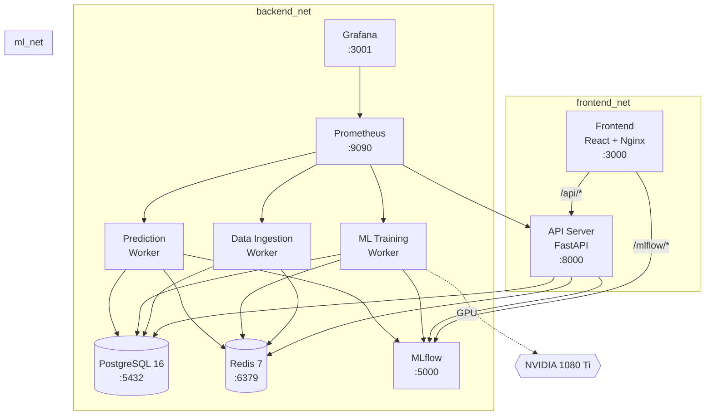
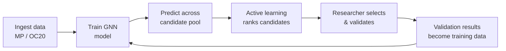
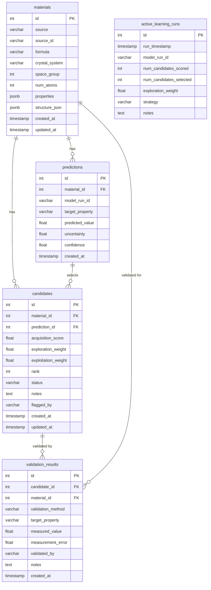
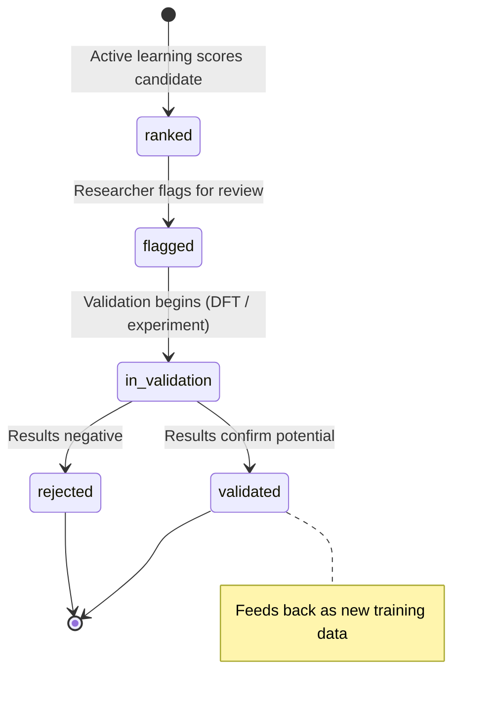

# Atlantis

**A catalyst discovery pipeline built on active learning.**

The name is a portmanteau of *Atlanta* and the idea of a catalyst — something that accelerates change without being consumed by it. Water splitting, CO₂ reduction, and other catalytic processes sit at the intersection of materials science and climate impact. Atlantis exists to make the search for better catalysts faster by replacing brute-force screening with an intelligent feedback loop.

## What it does

The search space of possible catalyst materials is astronomically large. Traditional lab work tests one material at a time. Atlantis flips that — it screens millions of candidates *in silico* using graph neural networks, surfaces the ones most worth testing in a real lab, and feeds validation results back into the model so each iteration gets smarter.

The pipeline ingests materials data from public databases (Materials Project, OC20), trains GNN models to predict catalytic properties, uses Bayesian optimization to rank candidates by a combination of predicted performance and model uncertainty, and tracks the full lifecycle from initial ranking through experimental validation.

## System architecture



## Active learning loop



Each iteration of this loop should make the model better. The active learning step is what makes it *efficient* — you're not validating randomly, you're validating the materials most likely to teach the model something new or reveal something valuable.

## Database schema



## Candidate lifecycle



## Tech stack

| Layer | Technology | Why |
|-------|-----------|-----|
| Database | PostgreSQL 16 | JSONB columns for variable-schema material properties |
| Cache / Broker | Redis 7 | Celery message broker + prediction cache |
| ML Tracking | MLflow 2.12 | Versioned experiment tracking, model registry |
| ML Models | PyTorch + PyTorch Geometric | GNN training (SchNet/MACE), CUDA for GPU |
| API | FastAPI | Async I/O, auto-generated OpenAPI docs |
| Frontend | React + Three.js + D3.js + Recharts | 3D molecular viz, dimensionality reduction plots, dashboards |
| Serving | Nginx | Static file serving + reverse proxy |
| Monitoring | Prometheus + Grafana | Metrics scraping across all services |
| Orchestration | Docker Compose | Multi-container orchestration with health checks |

## Two-machine dev setup

The pipeline is designed to run across two machines during development, split by what each machine is good at:

| Service | Alienware R7 (GPU + data) | ROG Ally X (portable) |
|---------|:-------------------------:|:---------------------:|
| PostgreSQL / Redis / MLflow | x | |
| data-ingestion-worker | x | x (connects to R7) |
| ml-training-worker | x (needs 1080 Ti) | |
| prediction-worker | | x (CPU-bound) |
| api / frontend | | x |
| prometheus / grafana | x | |

**R7** runs the GPU workload and data layer. **Ally X** runs everything that doesn't need a GPU.

To use the split setup, copy `.env.example` to `.env` on the Ally X and uncomment the remote override section, pointing `DATABASE_URL`, `REDIS_URL`, and `MLFLOW_TRACKING_URI` at the R7's IP.

```bash
# On the R7:
docker compose up db redis mlflow ml-training-worker data-ingestion-worker prometheus grafana

# On the Ally X:
docker compose up prediction-worker api frontend
```

For **single-machine** development (everything local), just:

```bash
docker compose up
```

## Getting started

```bash
# 1. Clone the repo
git clone <repo-url> && cd catalyst-pipeline

# 2. Create your env file
cp .env.example .env
# Edit .env — fill in passwords and your Materials Project API key

# 3. Start everything
docker compose up --build

# 4. Access the services
#    Frontend:   http://localhost:3000
#    API docs:   http://localhost:8000/docs
#    MLflow UI:  http://localhost:5000
#    Grafana:    http://localhost:3001
```

The database schema is applied automatically on first boot via `db/init.sql`.

## Project structure

```
catalyst-pipeline/
├── docker-compose.yml          # Orchestration (see header for R7/Ally X split)
├── .env.example                # Copy to .env, fill in secrets
│
├── db/
│   └── init.sql                # PostgreSQL schema (runs on first boot)
│
├── frontend/
│   ├── Dockerfile              # Multi-stage: npm build → nginx serve
│   ├── nginx.conf              # Static files + /api/* and /mlflow/* proxy
│   ├── package.json            # React + Three.js + D3.js + Recharts
│   └── src/                    # React application code
│
├── api/
│   ├── Dockerfile              # Python 3.11 + FastAPI + SQLAlchemy
│   └── app/
│       ├── main.py             # FastAPI app, routes, middleware
│       ├── models.py           # SQLAlchemy ORM models
│       ├── routes/
│       │   ├── candidates.py   # GET /candidates, filtering, ranking
│       │   ├── materials.py    # GET /materials, search, detail
│       │   ├── jobs.py         # POST /jobs/train, POST /jobs/predict
│       │   └── mlflow.py       # Proxy MLflow run history
│       └── tasks.py            # Celery task definitions
│
├── workers/
│   ├── ingestion/              # Materials Project + OC20 data fetch
│   ├── ml/                     # GNN training (SchNet/MACE, GPU-enabled)
│   └── prediction/             # Batch inference + Bayesian optimization
│
└── monitoring/
    ├── prometheus.yml           # Scrape targets
    ├── grafana-datasources/     # Auto-provision Prometheus datasource
    └── grafana-dashboards/      # Drop JSON dashboards here
```
